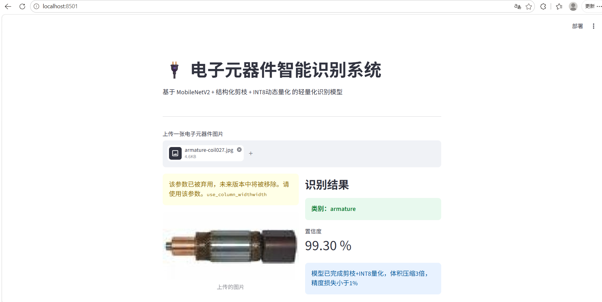
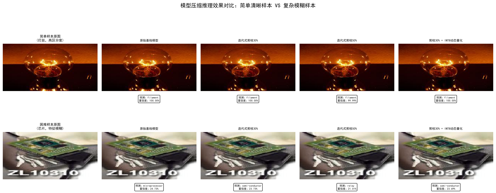

# 🔌 基于模型压缩的电子元器件智能识别系统

## MobileNetV2 + 结构化剪枝 + INT8量化的轻量化边缘部署方案

一个面向边缘部署场景的轻量化电子元器件图像识别系统。

本项目围绕深度学习模型从训练、优化到实际部署的完整工程流程展开，主要包括：

-   MobileNetV2 轻量化分类网络
-   基于通道裁剪的结构化剪枝
-   INT8 动态量化推理优化
-   TorchScript 模型部署
-   Streamlit 可视化推理系统

项目目标不仅是实现高精度元器件识别，更关注如何将深度学习模型优化为能够在资源受限环境中稳定运行的实际应用系统。

------------------------------------------------------------------------

# ✨ 项目亮点

  特性             工程实现
  ---------------- ----------------------------------------------
  轻量化模型设计   基于 MobileNetV2 构建电子元器件分类模型
  模型压缩优化     使用结构化剪枝去除冗余网络通道，降低计算开销
  推理效率优化     采用 INT8 动态量化提升部署效率
  完整工程流程     覆盖训练、压缩、评估、部署全流程
  交互式应用       基于 Streamlit 构建 Web 端实时识别系统

------------------------------------------------------------------------

# 🎯 项目背景与问题分析

深度学习模型通常通过增加网络规模获得更高精度，但在实际工业部署场景中，经常面临：

-   计算资源有限
-   模型存储空间受限
-   推理延迟要求高
-   研究模型难以直接落地

本项目针对上述问题，设计了一套完整的模型压缩与部署优化方案，将实验模型转化为可实际运行的轻量化智能系统。

------------------------------------------------------------------------

# 🧠 技术方案与工程实现

## 1. 基础模型构建

选择 MobileNetV2 作为基础网络结构。

选择原因：

-   深度可分离卷积降低计算量
-   适合移动端与边缘设备
-   在精度和效率之间取得较好平衡

------------------------------------------------------------------------

## 2. 结构化剪枝优化

采用结构化剪枝方法，对网络中的冗余通道进行裁剪。

相比传统非结构化剪枝：

-   能够减少真实计算量
-   更适合硬件部署
-   优化后的模型结构更加规整

------------------------------------------------------------------------

## 3. INT8量化优化

引入动态量化技术，将模型转换为 INT8 推理形式。

优化目标：

-   降低模型存储占用
-   提升 CPU 推理效率
-   保持识别性能稳定

------------------------------------------------------------------------

## 4. 部署系统开发

将优化后的模型集成至 Streamlit Web 应用，实现完整推理流程：

支持：

-   上传电子元器件图片
-   自动识别类别
-   输出预测置信度
-   展示模型优化信息

------------------------------------------------------------------------

# 📌 项目展示

## Web端识别 Demo

基于 Streamlit 构建轻量化推理应用，实现从模型部署到用户交互的完整流程。


支持：

- 上传电子元器件图片
- 自动识别类别
- 输出分类置信度
- 展示模型压缩优化信息


示例：




系统输出：

- 元器件类别：armature
- 分类置信度：99.30%
- 模型状态：剪枝 + INT8量化优化模型

------------------------------------------------------------------------

# 📊 优化结果
## 模型压缩效果验证


为了验证模型压缩后的性能变化，对比：

- 原始 MobileNetV2
- 结构化剪枝模型
- INT8量化模型



最终系统实现：

-   基于结构化剪枝的模型压缩
-   基于 INT8 的推理优化
-   轻量化部署能力
-   从训练到应用的完整闭环

------------------------------------------------------------------------

# 🏗️ 项目结构

``` text
.
├── configs              # 配置文件
├── data                 # 数据集及类别定义
├── deployment           # 部署应用
├── models               # 模型文件
│   ├── baseline         # 原始模型
│   ├── pruning          # 剪枝模型
│   └── quantized        # 量化模型
├── results              # 实验结果与可视化
├── src
│   ├── train            # 模型训练
│   ├── pruning          # 剪枝流程
│   ├── quantization     # 量化流程
│   └── evaluation       # 模型评估
└── README.md
```

------------------------------------------------------------------------

# 🚀 快速开始

安装依赖：

``` bash
pip install -r requirements.txt
```

启动 Web Demo：

``` bash
streamlit run deployment/app.py
```

打开浏览器即可上传电子元器件图片进行识别。

------------------------------------------------------------------------

# 🛠️ 技术栈

-   Python
-   PyTorch
-   TorchVision
-   MobileNetV2
-   结构化剪枝
-   INT8动态量化
-   TorchScript
-   Streamlit

------------------------------------------------------------------------

# 💡 工程思维

本项目的核心价值不仅是训练一个分类模型，而是完成从算法研究到工程落地的完整流程：

模型设计 → 性能优化 → 模型压缩 → 部署适配 → 实际应用

体现了将深度学习算法转化为高效、可靠、可部署智能系统的工程能力。
